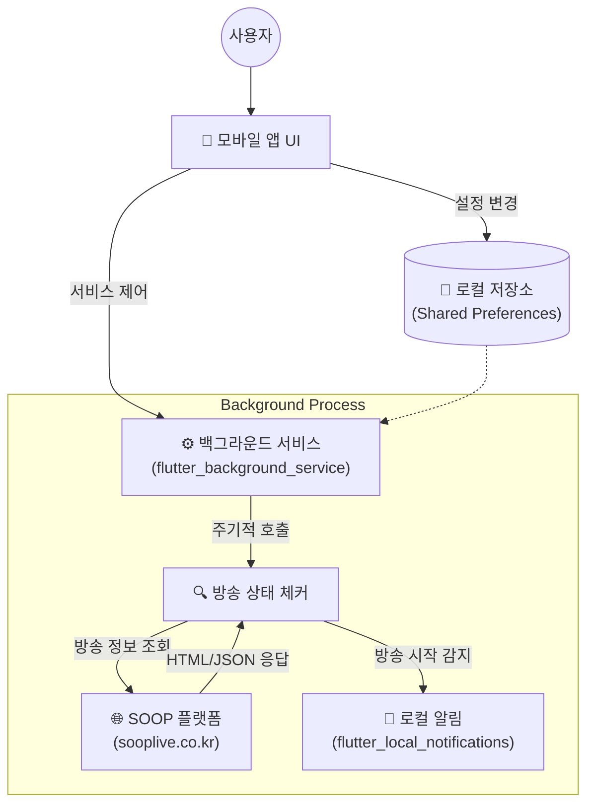

# SOOP 방송 알리미 (SOOP Notification App)

SOOP 플랫폼의 방송 상태를 백그라운드에서 확인하고 알림을 주는 모바일 애플리케이션입니다. Flutter를 사용하여 개발되었으며, 사용자가 등록한 즐겨찾기 스트리머의 방송 시작 여부를 실시간으로 알려줍니다.

## ✨ 주요 기능

- **실시간 방송 알림**: 백그라운드 서비스가 1분 간격으로 방송 상태를 체크하여 알림을 보냅니다.
- **스트리머 즐겨찾기 관리**: 원하는 스트리머를 ID로 검색하고 추가/삭제할 수 있습니다.
- **테마 모드 지원**: 다크 모드와 라이트 모드를 지원하여 사용자 취향에 맞게 설정할 수 있습니다. (앱 내 설정 및 시스템 설정 연동)
- **부팅 시 자동 실행**: 기기 재부팅 시 백그라운드 감시 서비스가 자동으로 시작됩니다.

## 🛠 아키텍처 (Architecture)



> **Note**: 다이어그램은 주요 컴포넌트 간의 데이터 흐름을 보여줍니다. 백그라운드 서비스는 앱이 종료된 상태에서도 주기적으로 SOOP 서버와 통신하여 상태를 확인합니다.

## 🚀 시작하기 (Getting Started)

이 프로젝트는 [Flutter](https://flutter.dev) 프레임워크로 제작되었습니다.

### 필수 조건

- Flutter SDK (3.0.0 이상)
- Android Studio 또는 VS Code
- Android/iOS 에뮬레이터 또는 실제 기기

### 설치 및 실행

1. **저장소 클론**
   ```bash
   git clone https://github.com/your-username/soop_notification_app.git
   cd soop_notification_app
   ```

2. **의존성 설치**
   ```bash
   flutter pub get
   ```

3. **앱 실행**
   ```bash
   flutter run
   ```

## 📱 사용 방법

1. 앱을 실행하고 알림 권한을 허용합니다.
2. 메인 화면 상단의 **+** 버튼을 눌러 스트리머의 ID를 입력하여 추가합니다.
3. 설정 메뉴에서 테마를 변경하거나 데이터 초기화를 할 수 있습니다.
4. 앱을 닫아도 백그라운드에서 방송 감시가 계속됩니다.

## 📦 배포 (Release)

GitHub Actions를 통해 태그가 푸시되면 자동으로 릴리즈 빌드가 생성됩니다.

```bash
git tag v1.0.0
git push origin v1.0.0
```
